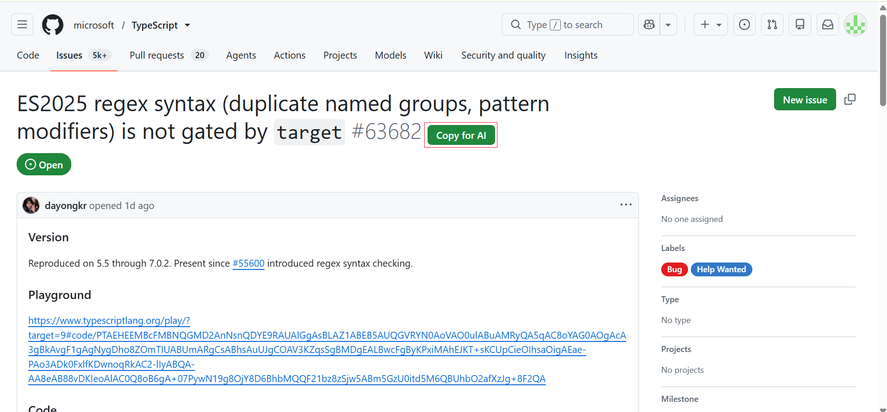
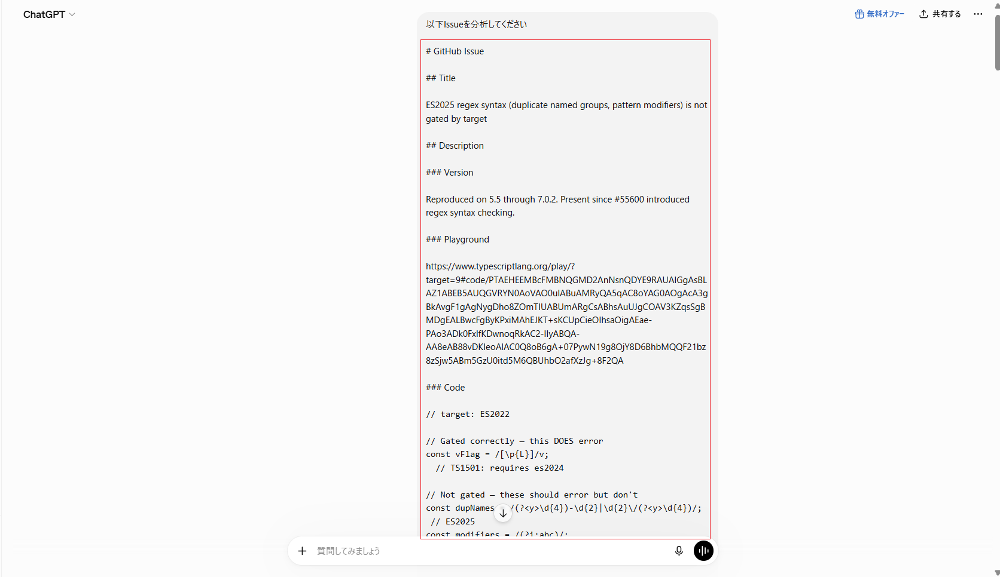
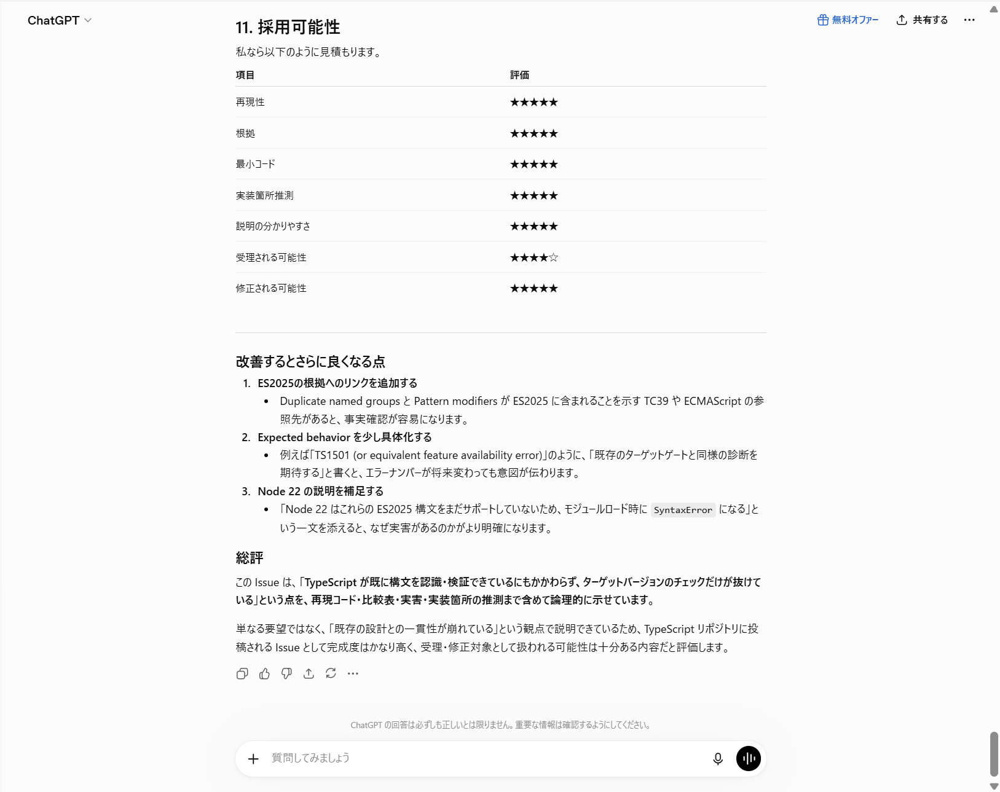

# GitPromptAssistant

GitHub Issueの内容をAIに渡しやすいMarkdown形式へ変換し、クリップボードへコピーするChrome拡張機能です。

## Install

👉 Available on the Chrome Web Store

https://chromewebstore.google.com/detail/xxxxxxxxxxxxxxxxxxxxxxxxxxxxxxxx

Compatible with:

- ChatGPT
- Gemini
- Claude
- GitHub Copilot Chat

## Features

- AIへ渡すためのプロンプトを生成
- Convert GitHub Issues into AI-friendly Markdown
- Preserve headings, lists, tables and code blocks
- Copy the generated prompt to the clipboard

## Usage

1. Chromeで拡張機能のデベロッパーモードを有効にする
2. 「パッケージ化されていない拡張機能を読み込む」からプロジェクトフォルダを選択する
3. GitHub Issueページを開く
4. `Copy for AI`ボタンをクリックする
5. コピーされた内容をChatGPT、GeminiなどのAIへ貼り付ける

## Current Status

Current MVP features:

- Copy GitHub Issue to Markdown
- Preserve headings
- Preserve bullet lists
- Preserve numbered lists
- Preserve tables
- Preserve code blocks
- Generate AI-friendly prompt
- Copy to clipboard

Planned for v0.2:

- Custom prompt templates
- Copy Prompt option
- Additional formatting improvements

## Development

- JavaScript
- Chrome Extension Manifest V3

## License

This project is licensed under the MIT License.
See the [LICENSE](LICENSE) file for details.

## Screenshots

### 1. GitHub Issue page

GitHub Issueに「Copy for AI」ボタンが表示されます。

---

### 2. Copy to clipboard

ボタンをクリックするとAI向けMarkdownがクリップボードへコピーされます。

---

### 3. Paste into AI

ChatGPTやGeminiへそのまま貼り付けます。

---

### 4. AI analysis result

AIがIssueを構造を保ったまま解析できます。